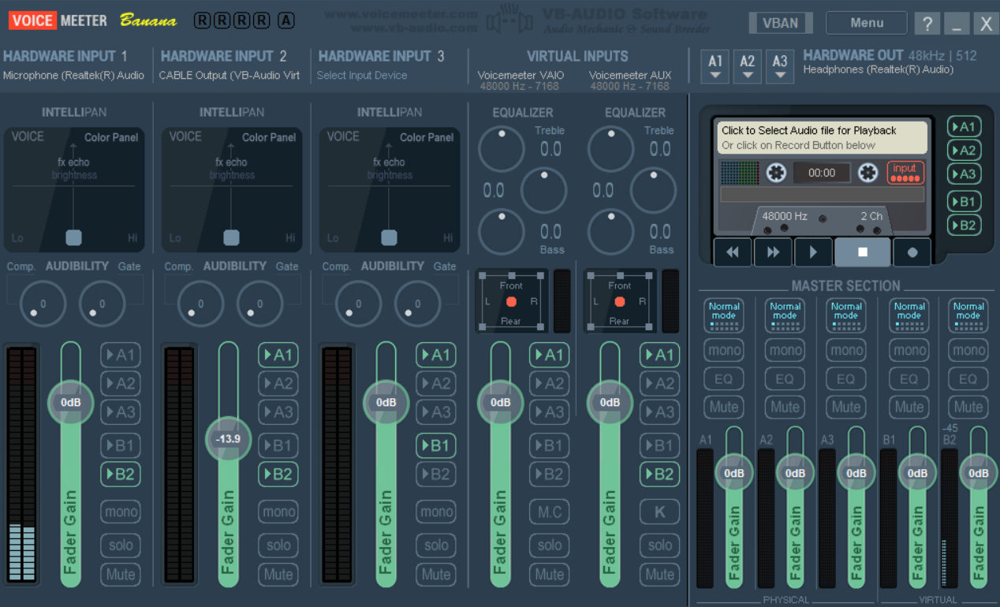

# ValorantCommsBot

Have you ever wanted to communicate with your teammates in Valorant, but you're too scared or don't have a mic? Well, here ya go!

This is a valorant bot that can be used to automate communications using voice clips from different games.
This was written because I was bored + inspiration from SociallyIneptWeeb

This bot was partially written because I hate talking in VC with random people, so why not spend half a year making a program to do it for me?
I guess other socially inept (haha) people can use it too, so win win?

The bot currently has a few modules working, and some that aren't. Particularly:
- The overlay is currently my focus as of 27/8/24
- EnemyManager requires a model, but works

Other modules should be working perfectly in main.py

# Setup and Usage:

Run the following (ideally in a venv):
```
pip install -r requirements.txt
```

Serverside ipynbs should be opened in Google Colab, and an NGROK token provided under the secret name "NGROKToken". The domains should be changed as well.   
This is mainly for the LLM ipynb file.

The overlay should be run from Overlay.py, and root directory from the content root. (Pycharm)   
The overlay will work for 1920x1080 monitors at 125% scaling on windows, since that is what I run, but may need tweaking for other scalings and resolutions.   
Aside from that, if the server is running and Valorant is in Borderless Windowed mode, it will show correctly!

EnemyManager now makes use of [YOLOv8](https://github.com/ultralytics/ultralytics) models from [Keremberke](https://huggingface.co/keremberke/yolov8m-valorant-detection)
If you want to use your own model, just replace the model in the EnemyManager.py file. I recommend putting them in Models/YOLO.

Some redundant code will be present, so just comment it out if you don't want to use it. I recommend commenting EnemyManager in main.py for a somewhat decent (yet small) release.

To configure it to play into the mic, install VBCable and Voicemeeter Banana
1. Ingame, set the input device to CABLE Output
2. In Voicemeeter, feel free to copy my below config, or see [SociallyIneptWeeb's Documenation](https://github.com/SociallyIneptWeeb/LanguageLeapAI/blob/main/docs/AUDIO.md) because his probject works similar to mine.
3. In Speaker.py, (Or MultiProcessingIsAMistake.py), uncomment the other sd.play line and the keyboard pressses.
4. Rebind the keyboard presses to push to talk, and set the device name to CABLE Input. (already set?)
5. If all of that didn't work, see [SociallyIneptWeeb's Documenation](https://github.com/SociallyIneptWeeb/LanguageLeapAI/blob/main/docs/AUDIO.md) and [this PR](https://github.com/SociallyIneptWeeb/LanguageLeapAI/pull/105/) because they explain it better than I could lol


As of writing, Python 3.13 isn't out, but will be within the year. I plan on migrating quickly due to the lack of the GIL, which will significantly improve this app's performance currently.
This is mainly to clean up the shitty multiprcessing code i've written, and will hopefully be faster when starting up different modules such as the EnemyManager. When this happens, it will definitely take a massive refactor tho lol


Fun note: Google colab doesn't seem to allow me to change the save directory when exporting ipynbs   
A lot of ipynbs will be in the root directory for now, but they will be moved eventually (they wont probably)


## Acknowledgements

- [YOLOv5](https://github.com/ultralytics/yolov5) by Ultralytics
  - License: AGPL v3.0
  
- [YOLOv8](https://github.com/ultralytics/ultralytics) by Ultralytics
  - License: AGPL v3.0

- [PyO3](https://github.com/PyO3/pyo3) 
  - License: MIT License

- [PyTorch](https://pytorch.org/)
  - License: BSD-3-Clause

- [OpenCV](https://opencv.org/)
  - License: Apache License 2.0

- [Tesseract](https://github.com/tesseract-ocr/tesseract) by Tesseract OCR
  - License: Apache License 2.0

Snake case stuff is often from AI, but not always, so thanks github copilot <3


# Disclaimer + Legal Stuff


*All voice clips copyright to their respective owner(s). This project does not claim 
ownership of any of the voice clips used in this project unless stated otherwise. 
This project does not knowingly intend or attempt to offend or violate any 
copyright or intellectual property rights of any entity. Some audio used on this 
project are taken from the web and believed to be in the public domain. In addition, 
to the best of this project's knowledge, all content is being used in compliance with the Fair Use Doctrine (Copyright Act of 1976, 
17 U.S.C. § 107.)The voice clips are provided for comment/criticism/news reporting/
educational purposes only.


Where every care has been taken to ensure the accuracy of the contents of this 
project, we do not warrant its completeness, quality and accuracy, nor can we 
guarantee that it is up-to-date. We will not be liable for any consequences 
arising from the use of, or reliance on, the contents of this project. The 
respective owners are exclusively responsible for external websites. This 
project accepts no liability of the content of external links.


Our project follows the safe harbor provisions of 17 U.S.C. §512, otherwise 
known as Digital Millennium Copyright Act (“DMCA”).


If any audio posted here are in violation of copyright law, please contact 
us and we will gladly remove the offending clips immediately upon receipt 
of valid proof of copyright infringement.
